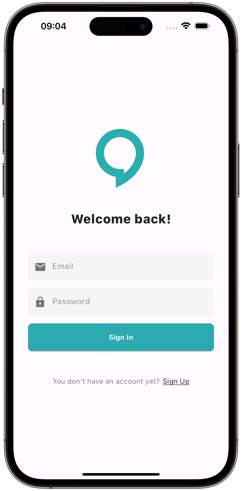
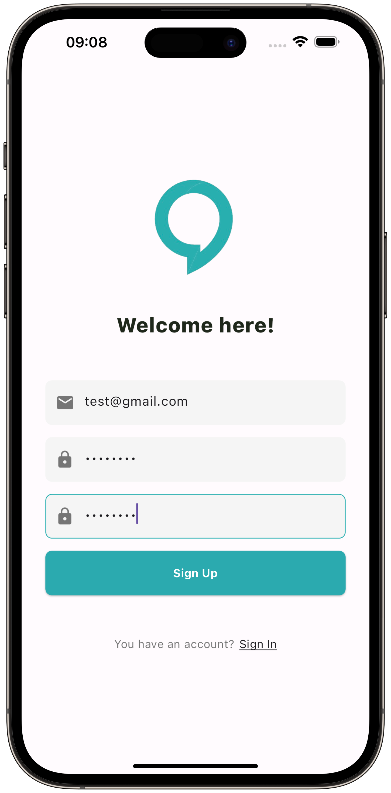
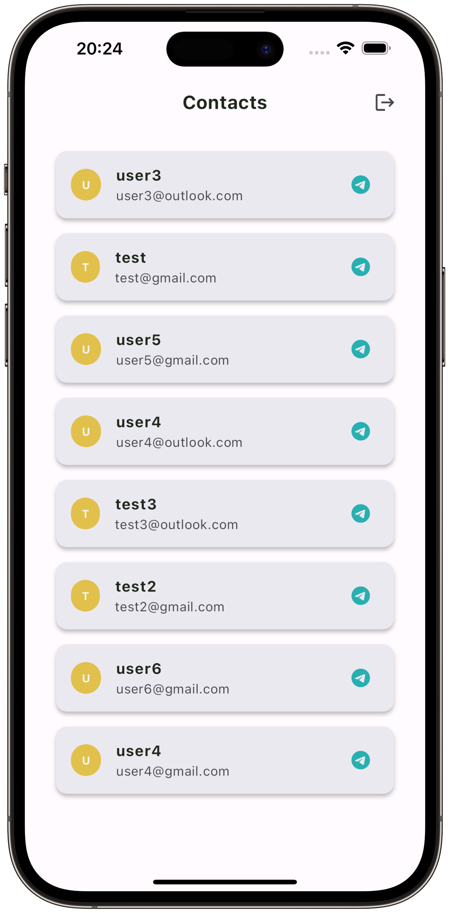
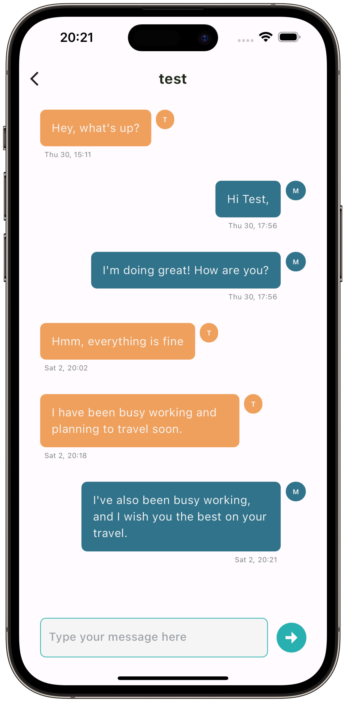

# chat_app

Sample of authentication and message sending, using Firebase and Flutter.

## Flutter Sample

<p align="center">




</p>

## File Structure

```bash
lib
├── components
│   ├── custom_btn.dart
│   ├── header_txt.dart
│   ├── logo.dart
│   ├── snack_bar.dart
│   ├── text_field.dart
│   └── w_components.dart
├── firebase_options.dart
├── main.dart
├── model
│   └── message.dart
├── routes
│   ├── app_routes.dart
│   └── route_generator.dart
├── services
│   ├── auth
│   │   ├── app_auth.dart
│   │   ├── login_auth.dart
│   │   └── service_auth.dart
│   └── chat
│       └── chat_service.dart
└── ui
    ├── constants
    │   ├── app_color.dart
    │   ├── app_constant.dart
    │   └── constants.dart
    ├── utils
    │   ├── spacings.dart
    │   ├── text_style.dart
    │   └── utils.dart
    └── view
        ├── chat
        │   ├── chat_page.dart
        │   └── components
        │       └── chat_bubble.dart
        ├── home
        │   └── home_page.dart
        ├── signin
        │   ├── components
        │   │   ├── email_field.dart
        │   │   ├── password_field.dart
        │   │   ├── small_txt_row.dart
        │   │   └── sn_components.dart
        │   └── signin_page.dart
        └── signup
            ├── components
            │   ├── confirm_pass_field.dart
            │   ├── email_field.dart
            │   ├── password_field.dart
            │   ├── small_txt_row.dart
            │   └── su_components.dart
            └── signup_page.dart
```

## Installation

To clone this project:

```sh
$ cd newProject
$ git clone https://github.com/pbmena/chat_app.git
$ flutter pub get
```

To install and update firebase in this project:

```sh
$ curl -sL https://firebase.tools | bash            # install CLI
$ npm install -g firebase-tools                     # update CLI version
$ firebase login                                    # log in to your account
$ firebase projects:list                            # check your project
$ dart pub global activate flutterfire_cli          # install FlutterFire
$ export PATH="$PATH":"$HOME/.pub-cache/bin"        # for macOS
$ flutterfire configure --project=name-app-00xx0    # enter your project information
$ flutter run android|ios
```

[package/firebase_core/Readme]: https://pub.dev/packages/firebase_core
[package/firebase_auth/Readme]: https://pub.dev/packages/firebase_auth
[package/cloud_firestore/Readme]: https://pub.dev/packages/cloud_firestore
[package/provider/Readme]: https://pub.dev/packages/provider
[package/intl/Readme]: https://pub.dev/packages/intl
[package/page_transition/Readme]: https://pub.dev/packages/page_transition

## Package

| Package         | Readme                           |
| --------------- | -------------------------------- |
| firebase_core   | [package/firebase_core/Readme]   |
| firebase_auth   | [package/firebase_auth/Readme]   |
| cloud_firestore | [package/cloud_firestore/Readme] |
| provider        | [package/provider/Readme]        |
| intl            | [package/intl/Readme]            |
| page_transition | [package/page_transition/Readme] |

## Getting Started

This project is a starting point for a Flutter application.

A few resources to get you started if this is your first Flutter project:

- [Lab: Write your first Flutter app](https://docs.flutter.dev/get-started/codelab)
- [Cookbook: Useful Flutter samples](https://docs.flutter.dev/cookbook)

For help getting started with Flutter development, view the
[online documentation](https://docs.flutter.dev/), which offers tutorials,
samples, guidance on mobile development, and a full API reference.
